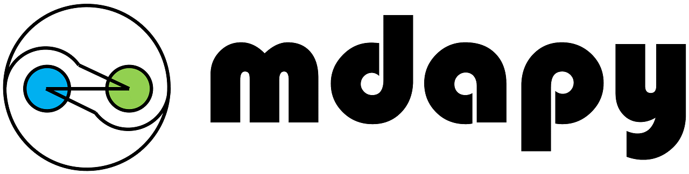

*mdapy* : Molecular Dynamics Analysis with Python
=====================================================

Overview
--------

The **mdapy** is a python library providing a set of simple, 
flexible and powerful tools to analyze the atomic trajectories 
generated from Molecular Dynamics (MD) simulations. 
Benefit by the `TaiChi <https://github.com/taichi-dev/taichi>`_ project, 
we can effectively accelerate the pure python code close to those written 
in C++. Moreover, **mdapy** is highly parallelized to make full use of 
resources of both multicore CPU and GPU. **mdapy** can directly handle the DUMP 
and DATA format in `LAMMPS <https://www.lammps.org/>`_. All data in **mdapy** is 
stored in NDARRAY format in `Numpy <https://numpy.org/>`_\ , enabling integration 
with the scientific ecosystem in python and corporation with other post-progressing 
codes, such as `OVITO <https://www.ovito.org/>`_ and `freud <https://github.com/glotzerlab/freud>`_. 

Resources
----------

- Homepage: `https://github.com/mushroomfire/mdapy <https://github.com/mushroomfire/mdapy>`_
- Documentation: `https://mdapy.readthedocs.io/ <https://mdapy.readthedocs.io/>`_
- Source Code: `https://github.com/mushroomfire/mdapy <https://github.com/mushroomfire/mdapy>`_
- Issue Tracker: `https://github.com/mushroomfire/mdapy/issues <https://github.com/mushroomfire/mdapy/issues>`_

Dependencies
------------

* `python <https://www.python.org/>`_ (3.7-3.10)
* `taichi==1.2.0 <https://github.com/taichi-dev/taichi>`_
* `numpy <https://numpy.org/>`_
* `scipy <https://scipy.org/>`_
* `pandas <https://pandas.pydata.org/>`_
* `tqdm <https://github.com/tqdm/tqdm>`_
* `matplotlib <https://matplotlib.org/>`_
* `SciencePlots <https://github.com/garrettj403/SciencePlots>`_
* `pyfftw <https://github.com/pyFFTW/pyFFTW>`_ (Optional, for fast FFT)

Installation
==============

1. Download source code
   
   .. code-block:: bash

      git clone https://github.com/mushroomfire/mdapy.git
      cd mdapy 

2. Create a virtual environment (highly recommoned using anaconda)
   
   - It helps you to avoid the potential conflicts of dependencies in your current python environment and is very suitable for beginners. If you have installed all dependencies listed above, you can just skip this step!
   
   .. code-block:: bash

      conda create -n mda python==3.8.0 # python version larger than 3.7 and lower than 3.11 is okay.
      conda activate mda

3. Install dependencies
   
   .. code-block:: bash

      pip install -r requirements.txt

4. Install mdapy
   
   .. code-block:: bash

      python install.py

5. Update mdapy
   
   - Just download the latest souce code and repeat the step 3 and step 4.

Usage
------

.. code-block:: python

   import mdapy as mp
   mp.init('cpu') # use cpu, mp.init('gpu') will use gpu to compute.

   system = mp.System('./CoCuFeNiPd-4M.dump') # read dump file to generate a system class
   system.cal_centro_symmetry_parameter() # calculate the centrosymmetry parameters
   system.cal_atomic_entropy() # calculate the atomic entropy
   system.write_dump() # save results to a new dump file
