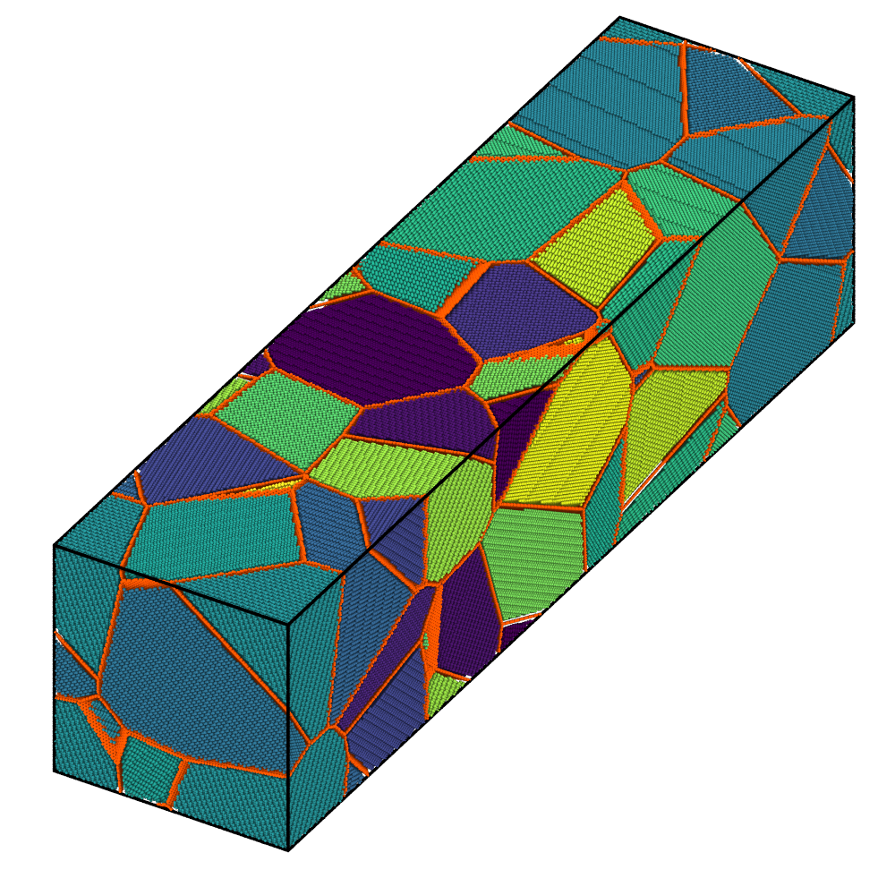
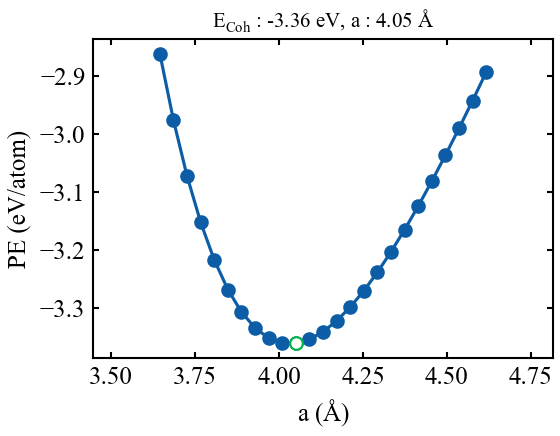
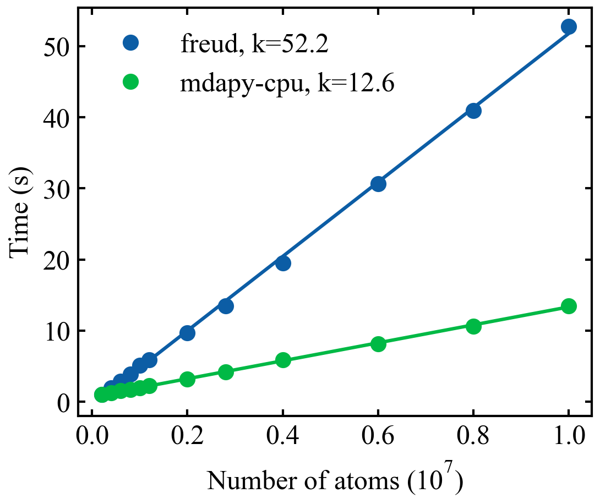
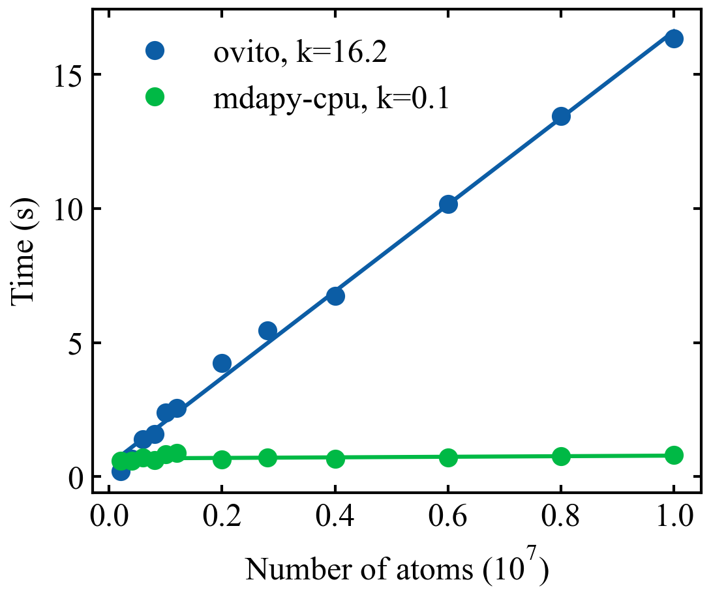
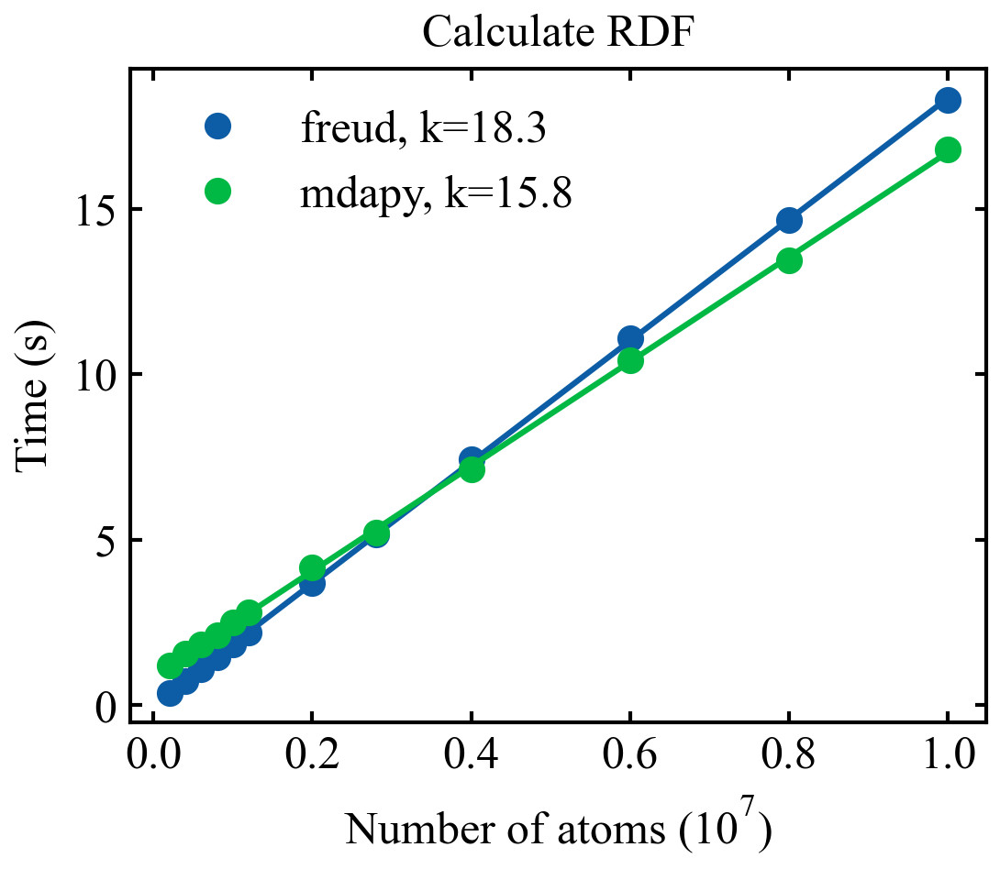
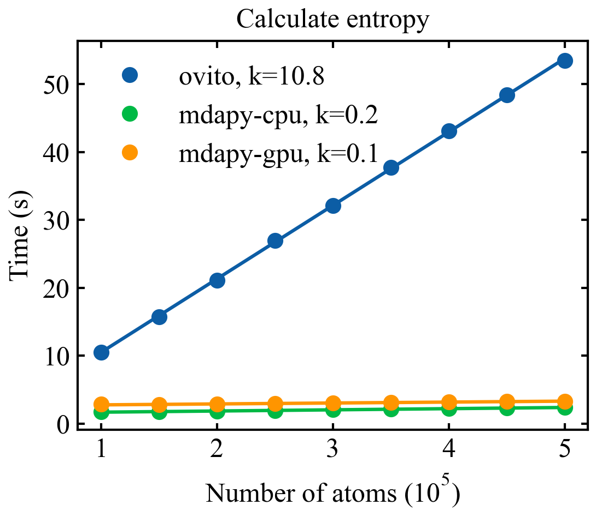
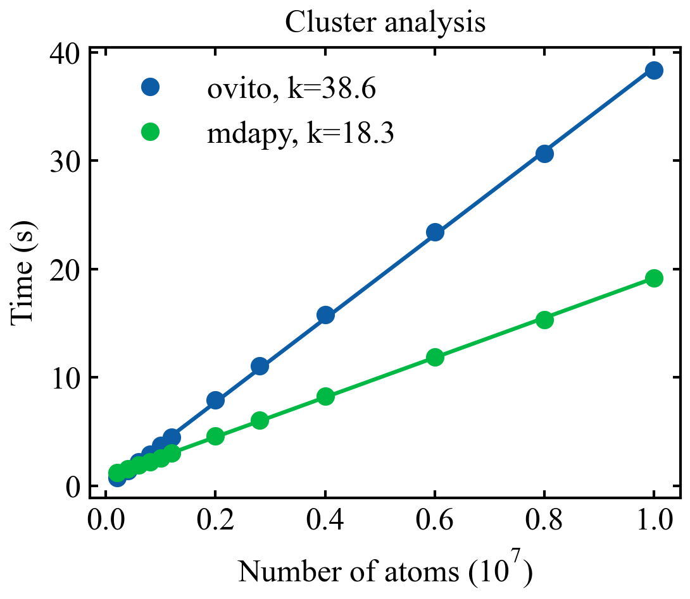

# *mdapy* : Molecular Dynamics Analysis with Python
## Overview
The **mdapy** is a python library providing a set of simple, flexible and powerful tools to analyze the atomic trajectories generated from Molecular Dynamics (MD) simulations. Benefit by the [TaiChi](https://github.com/taichi-dev/taichi) project, we can effectively accelerate the pure python code close to those written in C++. Moreover, **mdapy** is highly parallelized to make full use of resources of both multicore CPU and GPU. **mdapy** can directly handle the DUMP and DATA format in [LAMMPS](https://www.lammps.org/). All data in **mdapy** is stored in NDARRAY format in [Numpy](https://numpy.org/), enabling integration with the scientific ecosystem in python and corporation with other post-progressing codes, such as [OVITO](https://www.ovito.org/) and [freud](https://github.com/glotzerlab/freud). 
## Dependencies
- python (>=3.7 and < 3.11)
- taichi
- numpy
- scipy
- pandas
- pyfftw
- tqdm
- matplotlib
- SciencePlots
## Install
1. Download source code
   ```bash
   git clone https://github.com/mushroomfire/mdapy.git
   cd mdapy 
   ```
2. Create a virtual environment (highly recommoned using anaconda)
   - It helps you to avoid the potential conflicts of dependencies in your current python environment and is very suitable for beginners. If you have installed all dependencies listed above, you can just skip this step!
   ```bash
   conda create -n mda python==3.8.0 # python version larger than 3.7 and lower than 3.11 is okay.
   conda activate mda
   ```
3. Install dependencies
    ```bash
   pip install -r requirements.txt
   ```
4. Install mdapy
   ```python
   python install.py
   ```
5. Update mdapy
   - Just download the latest souce code and repeat the step 3 and step 4.
## Usage
- More examples can be found in mdapy/example folder
1. Structure analysis
```python
import mdapy as mp
mp.init('cpu') # use cpu, mp.init('gpu') will use gpu to compute.

system = mp.System('./CoCuFeNiPd-4M.dump') # read dump file to generate a system class
system.cal_centro_symmetry_parameter() # calculate the centrosymmetry parameters
system.cal_atomic_entropy() # calculate the atomic entropy
system.write_dump() # save results to a new dump file
```
2. Mean squared displacement and Lindemann index
```python
import mdapy as mp
mp.init('cpu')

dump_list = [f'melt.{i}.dump' for i in range(100)] # obtain all the dump filenames in a list
MS = mp.MultiSystem(dump_list) # read all the dump file to generate a MultiSystem class
MS.cal_mean_squared_displacement() # calculate the mean squared displacement
MS.MSD.plot() # one can plot the MSD per frame
MS.cal_lindemann_parameter() # calculate the lindemann index
MS.Lindemann.plot() # one can plot lindemann index per frame
MS.write_dumps() # save results to a serials of dump files
```
3. Create polycrystalline with graphene boundary
```python
import mdapy as mp
import numpy as np
mp.init('cpu')

box = np.array([[0, 800.], [0, 200.], [0, 200.]]) # create a box
seednumber = 20 # create 20 seeds to generate the voronoi polygon
metal_lattice_constant = 3.615 # lattice constant of metallic matrix
metal_lattice_type = 'FCC' # lattice type of metallic matrix
randomseed = 1 # control the crystalline orientations per grains
add_graphene=True # use graphen as grain boundary
poly = mp.CreatePolycrystalline(box, seednumber, metal_lattice_constant, metal_lattice_type, randomseed=randomseed, add_graphene=add_graphene, gra_overlap_dis=1.2)
poly.compute() # generate a polycrystalline with graphene boundary
```

4. Calculate the EOS curve
```python
import numpy as np
import matplotlib.pyplot as plt
import mdapy as mp
from mdapy.plot.pltset import pltset, cm2inch
mp.init('cpu')

def get_enegy_lattice(lattice_constant, potential):
    x, y, z = 3, 3, 3
    FCC = mp.LatticeMaker(lattice_constant, "FCC", x, y, z) # build a FCC lattice
    FCC.compute()
    neigh = mp.Neighbor(FCC.pos, FCC.box, potential.rc, max_neigh=150) # build neighbor list
    neigh.compute()
    Cal = mp.Calculator(
            potential,
            ["Al"],
            np.ones(FCC.pos.shape[0], dtype=np.int32),
            neigh.verlet_list,
            neigh.distance_list,
            neigh.neighbor_number,
            FCC.pos,
            [1, 1, 1],
            FCC.box,
        ) # calculate the energy
    Cal.compute()
    return Cal.energy.mean()

eos = []
lattice_constant = 4.05
potential = mp.EAM("Al_DFT.eam.alloy") # read a eam.alloy potential file
for scale in np.arange(0.9, 1.15, 0.01): # loop to get different energies
    energy = get_enegy_lattice(lattice_constant*scale, potential)
    eos.append([scale*lattice_constant, energy])
eos = np.array(eos)

# plot the eos results
fig = plt.figure(figsize=(cm2inch(10), cm2inch(7)), dpi=150)
plt.subplots_adjust(bottom=0.18, top=0.92, left=0.2, right=0.98)
plt.plot(eos[:,0], eos[:,1], 'o-')
e_coh = eos[:,1].min()
a_equi = eos[np.argmin(eos[:, 1]), 0]
plt.plot([a_equi], [e_coh], 'o', mfc='white')
plt.title(r'$\mathregular{E_{Coh}}$ : %.2f eV, a : %.2f $\mathregular{\AA}$' % (e_coh, a_equi), fontsize=10)
plt.xlim(eos[0,0]-0.2, eos[-1,0]+0.2)
plt.xlabel("a ($\mathregular{\AA}$)")
plt.ylabel(r"PE (eV/atom)")
ax = plt.gca()
plt.show()
```

## Benchmark
- All python script files can be found in mdapy/benchmark folder.
- CPU: Intel(R) Xeon(R) CPU E5-2630 v4 @ 2.20GHz
- Memory: 64 Gb
- mdapy version: 0.7.2, freud version: 2.12.0, ovito version: 3.7.11
1. Build neighbor list.

1. Build FCC lattice structure.

1. Calculate radial distribution functions

1. Calculate atomic entropy.

1. Cluster analysis.


## Citations
If you use **mdapy** to process data for publication, please use this citation:
```latex
@article{mdapy2022,
    title = {mdapy: A simple and fast analysis software for molecular dynamics simulations with python},
    author = {Yong-Chao Wu, XiaoYa Chang, Jian-Li Shao},
    journal = {},
    volume = {},
    pages = {},
    year = {2022},
    issn = {},
    doi = {},
    url = {},
    keywords = {Simulation analysis, Molecular dynamics},
}
```